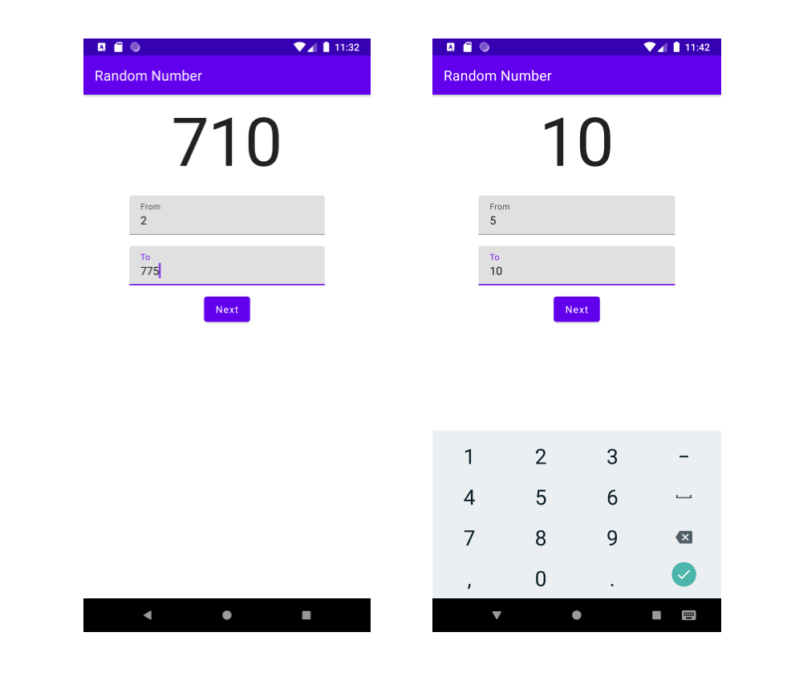

# Random Number - An Jetpack Compose MVI Example

Main object of the project is to practice and demonstrate the use of the Model-View-Intent archeticture for Android 
within a Jetpack Compose UI.

## Tech Stack

- [100% Kotlin](https://kotlinlang.org/)
- [AndroidX](https://developer.android.com/jetpack/androidx/)
- [Jetpack Compose](https:developer.android.com/jetpack/compose)
- [Jetpack Architecture Components](https:developer.android.com/jetpack)
- Clean MVVM + MVI (presentation layer)

## Screenshots

